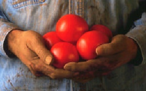
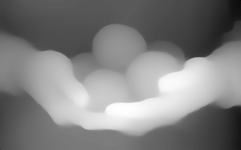
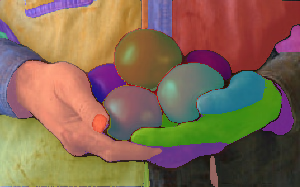
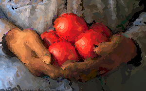

# ICG Final Project
- Requirements

```
pip install -r requirements.txt
```

- Weight of SAM

   - please download pretrain weight, and place in 'weights' folder: 
   - https://github.com/facebookresearch/segment-anything?tab=readme-ov-file#model-checkpoints


- run code to render oil painting style of image

   - run code in draw_layers.ipynb

   - put your image under images

   - change the image_name in draw_layers.ipynb


### Input Image & Output of DAM
 
 

### Output of SAM & Output of our Algorithm

 